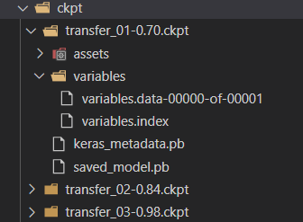
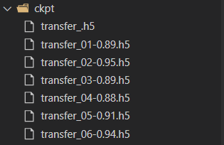
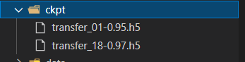

# tensorflow2 模型的保存和载入 h5和ckpt的用法 | 小记

## 断点续训/检查点

```python
# 断点续训
checkpoint_path = 'ckpt/transfer_{epoch:02d}-{val_acc:.2f}.ckpt'  # 格式化字符，防止文件名冲突
checkpoint_callback = tf.keras.callbacks.ModelCheckpoint(checkpoint_path,  # 保存路径
                                monitor='val_acc',  # 监测指标，这里是测试集的acc
                                save_weights_only=False,  #是否只保存权重
                                mode='auto',
                                period=1  # 每period个周期保存一次
                                )
# 需要在fit/fit_generator()中添加该回调函数
history_ft = model.fit_generator(
                                        train_generator,
                                        steps_per_epoch=steps_per_epoch,
                                        epochs=epochs,
                                        validation_data=validation_generator,
                                        validation_steps=validation_steps,
                                        callbacks = [checkpoint_callback])
```

### **保存全部模型**（ckpt）：



读取方法：

```python
model = tf.keras.models.load_model('./ckpt/transfer_03-0.98.ckpt')
```

### 保存全部模型（h5）:



读取方法:

```python
model = load_model('./ckpt/transfer_06-0.94.h5')
```


### **仅保存权重（ckpt）**：


读取方法：

```python
checkpoint_path = 'ckpt/transfer_{epoch:02d}-{val_acc:.2f}.ckpt'
checkpoint_dir = os.path.dirname(checkpoint_path)
latest_model = tf.train.latest_checkpoint(checkpoint_dir)  # 找到最新保存的断点
model.load_weights(latest_model)  # 读取权重，model的结构必须与训练的网络结构一致
```

### 仅保存权重（h5）



```python
model.load_weights('./ckpt/transfer_18-0.97.h5')
```

**tf.train.latest_checkpoint()** 方法用于找到目录下**最新**的检查点

并且似乎**只对ckpt有作用**

## model.save()保存模型

```python
path_save_model = 'model/my_saved_InceptionV3_model.h5'
model.save(path_save_model, overwrite=True)
```

